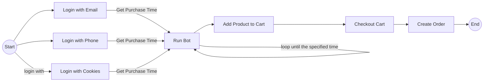

# Shopee Auto Buy/Checkout Product

## Goals
This program was created to make it easier for users to make product transactions on the Shopee e-commerce website

## Description
This program is a **BOT** that will automatically purchase a product based on the information entered by the user. The information required is as follows:

 1. Login information (such as email, password, phone number, or cookies);
 2. Product information (containing product links)
 3. Purchase time information (containing hours and minutes when the product will be purchase)

This program is made using the **Python** and uses the **Selenium** library.

## Flowchart

## Requirement

 - [ ] Python 3.8.x
 - [ ] Google Chrome
 - [ ] PIP

## How To Use

Install **Selenium** and **Undetected Chromedriver** library

    pip install selenium undetected-chromedriver
or

    pip install -r requirements.txt

Setup Login Configuration in file *login.py*. Fill in the variables according to their needs

    // Login with Email
    email="YOUR_EMAIL_HERE"
    password="YOUR_PASSWORD_HERE"
    
    // Login with Phone
    phone="YOUR_PHONE_NUMBER_HERE"
    
    // Login with Cookies
    cookie='YOUR_COOKIES_HERE' // cookies value from SPC_EC

Run Program

    python bot.py

## How to Get Cookies Value

**Open** Google Chrome and go to Shopee (make sure you have **logged in**)
**Open** Product Link and **Press** `Ctrl+Shift+I`
**Click** on tab `Network` and **Refresh** Browser
**Find** and **Click** `https://shopee.co.id/api/v2/item/get itemid=xxx&shopid=xxx`
**Click** on tab `Cookies` and **Find** `SPC_EC`
**Copy** value and **Place** on `login.py`
